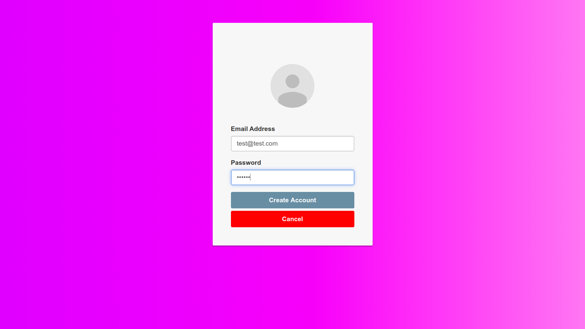
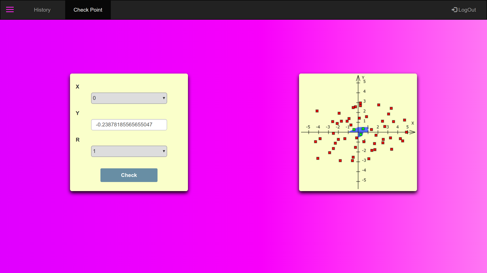
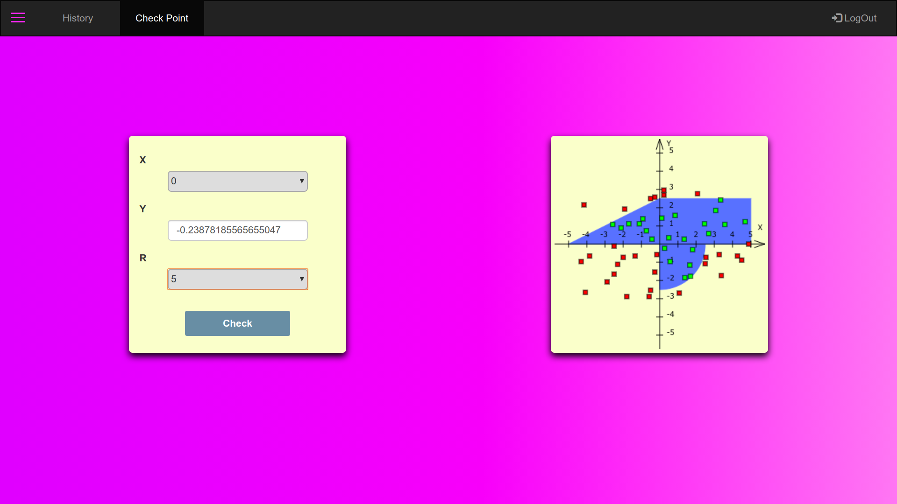
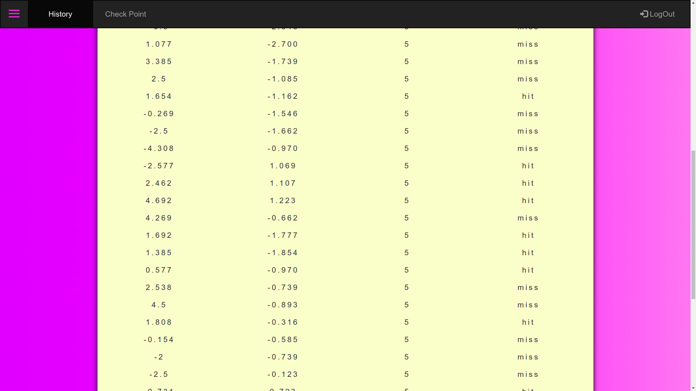
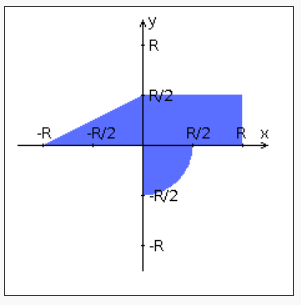
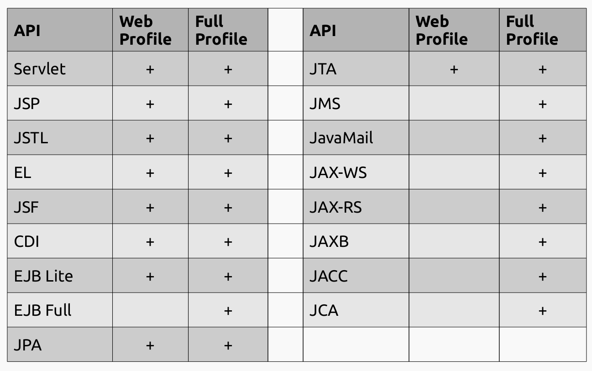

## Задание
Переписать приложение из предыдущей лабораторной работы с использованием следующих технологий:
 
- Уровень back-end должен быть основан на Spring.
- Уровень front-end должен быть построен на Angular 2+ с использованием обычных полей ввода HTML
- Взаимодействие между уровнями back-end и front-end должно быть организовано посредством REST API.

Приложение по-прежнему должно включать в себя 2 страницы - стартовую и основную страницу приложения. Обе страницы приложения должны быть адаптированы для отображения в 3 режимах:
 
- "Десктопный" - для устройств, ширина экрана которых равна или превышает 1180 пикселей.
- "Планшетный" - для устройств, ширина экрана которых равна или превышает 718, но меньше 1180 пикселей.
- "Мобильный"- для устройств, ширина экрана которых меньше 718 пикселей.

## Стартовая страница должна содержать следующие элементы:
- "Шапку", содержащую ФИО студента, номер группы и номер варианта.
- Форму для ввода логина и пароля. Информация о зарегистрированных в системе пользователях должна храниться в отдельной таблице БД (пароль должен храниться в виде хэш-суммы). Доступ неавторизованных пользователей к основной странице приложения должен быть запрещён.

## Основная страница приложения должна содержать следующие элементы:
- Набор полей ввода для задания координат точки и радиуса области в соответствии с вариантом задания: Select {'-2','-1.5','-1','-0.5','0','0.5','1','1.5','2'} для координаты по оси X, Text (-3 ... 3) для координаты по оси Y, и Select {'-2','-1.5','-1','-0.5','0','0.5','1','1.5','2'} для задания радиуса области. Если поле ввода допускает ввод заведомо некорректных данных (таких, например, как буквы в координатах точки или отрицательный радиус), то приложение должно осуществлять их валидацию.
- Динамически обновляемую картинку, изображающую область на координатной плоскости в соответствии с номером варианта и точки, координаты которых были заданы пользователем. Клик по картинке должен инициировать сценарий, осуществляющий определение координат новой точки и отправку их на сервер для проверки её попадания в область. Цвет точек должен зависить от факта попадания / непопадания в область. Смена радиуса также должна инициировать перерисовку картинки.
- Таблицу со списком результатов предыдущих проверок.
- Кнопку, по которой аутентифицированный пользователь может закрыть свою сессию и вернуться на стартовую страницу приложения.

## Дополнительные требования к приложению:
- Все результаты проверки должны сохраняться в базе данных под управлением СУБД PostgreSQL.
- Для доступа к БД необходимо использовать Spring Data.

## Вопросы к защите лабораторной работы:
1. Платформа Java EE. Спецификации и их реализации.  
Набор спецификаций - см. 4 вопрос.  
Реализации: GlassFish, WildFly, TomEE, IBM WebSphere и т.д.
1. Принципы IoC, CDI и Location Transparency. Компоненты и контейнеры.  
https://habr.com/ru/post/321344/  
**Location Transparency**

1. Управление жизненным циклом компонентов. Дескрипторы развёртывания.
1. Java EE API(Спецификации). Виды компонентов. Профили платформы Java EE.  

JAXB - https://www.codeflow.site/ru/article/jaxb  
JACC - спецификация, определяющая взаимодествие между сервером приложений Java EE и сервисом авторизации.  
JCA - https://habr.com/ru/post/251131/
1. Компоненты EJB. Stateless & Stateful Session Beans. EJB Lite и EJB Full.  
https://ejb.javadev.ru
1. Работа с электронной почтой в Java EE. JavaMail API.  
http://www.quizful.net/post/java-mail-api
1. JMS. Реализация очередей сообщений. Способы доставки сообщений до клиента. Message-Driven Beans.  
http://java-online.ru/javax-jms.xhtml
1. Понятие транзакции. Управление транзакциями в Java EE. JTA.  
http://www.javaportal.ru/java/articles/transJ2EE.html  
1. Веб-сервисы. Технологии JAX-RS и JAX-WS.  
https://www.ibm.com/developerworks/ru/library/wa-jaxrs/index.html  
https://www.ibm.com/developerworks/ru/edu/ws-jax/index.html
1. Платформа Spring. Сходства и отличия с Java EE.  
https://dou.ua/lenta/articles/javaee-vs-spring/
1. Модули Spring. Архитектура Spring Runtime. Spring Security и Spring Data.  
https://habr.com/ru/post/222579/
https://ru.wikibooks.org/wiki/Spring_Security/Технический_обзор_Spring_Security  
https://habr.com/ru/post/435114/
1. Реализация IoC и CDI в Spring. Сходства и отличия с Java EE.  
https://sysout.ru/rabota-s-ioc-kontejnerom-v-spring/
1. Реализация REST API в Java EE и Spring.  
В Java EE реализуется при помощи JAX-RS.  
В Spring - при помощи Spring Web.
1. React JS. Архитектура и основные принципы разработки приложений.
1. Компоненты React. State & props. "Умные" и "глупые" компоненты.
1. Разметка страниц в React-приложениях. JSX.
1. Навигация в React-приложениях. ReactRouter.
1. Управление состоянием интерфейса. Redux.
1. Angular: архитектура и основные принципы разработки приложений.
1. Angular: модули, компоненты, сервисы и DI.
1. Angular: шаблоны страниц, жизненный цикл компонентов, подключение CSS.
1. Angular: клиент-серверное взаимодействие, создание, отправка и валидация данных форм.
